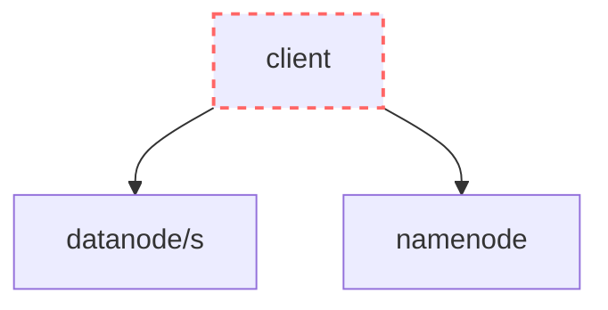

# Building HDFS from scratch with Python

The goal of this lab is to build a distributed file storage system that allows the user to upload and download files, which we will call SSHDFS (Super Simple HDFS).

This lab is inspired by [The Hadoop Distributed File System (2010)](https://pages.cs.wisc.edu/~akella/CS838/F15/838-CloudPapers/hdfs.pdf).

# Table of contents

- [Exercises](#exercises)
    - [Seminar 1: HDFS, FastAPI and Docker](#seminar-1-hdfs-fastapi-and-docker)
    - [Lab 1: Namenode](#lab-1-namenode)
    - [Lab 2: Datanode](#lab-2-datanode)
    - [Lab 3: Client](#lab-3-client)

- [Design](#design)
    - [client](#client)
    - [namenode](#namenode)
    - [datanode](#datanode)

# Grade

We have divided exercises into three categories:
- (*) Mandatory: 80% of the project grade, the bare minimum to get it to work
- (**) Recommended: 20% of the project grade
- (***) Optional: addtional +2/10

# Exercises

## Seminar 1: HDFS, FastAPI and Docker

During this lab, you will review HDFS and learn how to code APIs with FastAPI and deploy them with Docker.

Run [fastapi-quickstart](../../resources/fastapi-quickstart/) using `docker compose up`.

This starts a Python API service and runs it inside a Docker container.

The [main.py](../../resources/fastapi-quickstart/app/main.py) file implements 3 API endpoints.

The [compose.yaml](../../resources/fastapi-quickstart/compose.yaml) file describes how to build a Docker image with the API and which port to run it on. `ports: "8001:80"` means forward all traffic of port 8001 in this computer to port 80 inside the Docker container.

Try using `curl` to send an HTTP request to the server:

```zsh
curl "http://localhost:8001/info"
```

```zsh
curl "http://localhost:8001/items/234?q=aloha"
```


### [S1Q0] [5 marks] Building your first API (*)

Extend the service with two new endpoints: `POST /sum` and `POST /multiply/{a}/{b}`.

The sum endpoint must receive a [JSON object with two numbers in the body](https://fastapi.tiangolo.com/tutorial/body/) and return the sum.

```
POST http://localhost:8000/sum
```

Body:
```json
{
    "x": 23,
    "y": 32
}
```

Response:
```json
{
    "result": 55
}
```

Paste a screenshot where you test the POST request to your service using `curl`:

```zsh
curl -X POST "http://localhost:8000/sum" -H "Content-Type: application/json" -d '{"x":23, "y": 32}'
```


The multiply endpoint must receive a [JSON object with two numbers in the path](https://fastapi.tiangolo.com/tutorial/path-params/) and return the multiplication.

```
POST http://localhost:8000/multiply/2/6
```

Response:
```json
{
    "result": 12
}
```

Paste a screenshot where you test the POST request to your service using `curl`:

```zsh
curl -X POST "http://localhost:8000/multiply/4/5"
```


### [S1Q1] [20 marks] Diagram HDFS (*)

Create 4 [sequence diagrams with Mermaid](https://mermaid.js.org/syntax/sequenceDiagram.html) showing:
- Process to write a file to HDFS
- Process to write a file to SSHDFS (without pipelines)
- Process to read a file from HDFS
- Process to fix underreplicated blocks in HDFS

## Lab 1: namenode

During this lab session, you must build the `namenode` service as described in [namenode](#namenode). The `namenode` service should have an API that allows creating files, adding blocks to files and reading the file metadata.

### [L1Q0] [10 marks] GET /datanodes (*)

Create a basic FastAPI service in [projects\1-hdfs\namenode](./namenode/) with its Dockerfile. In the `settings.json` file, write a [JSON object with 3 data nodes](#namenode-filesystem). Make sure you can start the service with `docker compose up`.

Then, implement the first endpoint of the `namenode` API: [GET /datanodes](#get-datanodes). Your code must [read](https://python.land/data-processing/working-with-json#How_to_read_a_JSON_file_in_python) the configured `datanodes` from the `settings.json` file and return them.

Test it works with curl and paste a screenshot.

> [!TIP]
> To paste the screenshot, save it to the [screeenshots](./screenshots/) folder and then [embed it into this markdown file](https://stackoverflow.com/a/52003495).


### [L1Q1] [10 marks] POST /files (*)

Implement the [POST /files](#post-files) endpoint.

- New files have no blocks by default.
- Make sure you handle edge cases properly (empty file name, file name that already exists, ...)
- [Write](https://python.land/data-processing/working-with-json#How_to_write_JSON_to_a_file_in_python) the [metadata of the new file to `checkpoint.json`](#namenode-filesystem).

Test it works with curl and paste a screenshot.

### [L1Q2] [10 marks] POST /files/{filename}/blocks (*)

Implement the [POST /files/{filename}/blocks](#post-files-blocks) endpoint to allow appending a new block to a file.

- [Read](https://python.land/data-processing/working-with-json#How_to_read_a_JSON_file_in_python) the [number of replicas, `datanodes` and block size from `settings.json`](#namenode-filesystem).
- Choose which `datanodes` will host replicas of the block
- Update the [metadata of the file in `checkpoint.json`](#namenode-filesystem) to add the new block.

Test it works with curl and paste a screenshot.

### [L1Q3] [10 marks] GET /files/{filename} (*)

Implement the [GET /files/{filename}](#get-filesfilename) endpoint. 

- [Read the file name being requested from the URL path](https://fastapi.tiangolo.com/tutorial/path-params/)
- Read and return the file metadata from `checkpoint.json`.
- Make sure you handle edge cases (file name that does not exist, ...).

Test it works with curl and paste a screenshot.

### [L1Q4] [20 marks] The journal (**)

When the `namenode` starts, read the `checkpoint.json` file and replay the journal on top to store an in-memory image of the system. Then, store the new checkpoint file to the file system.

Whenever a new file is created or a block is appended, apend the change to the journal file.

### [L1Q5] [5 marks] Deleting files (***)

Implement the [DELETE /files/{filename}](#delete-filesfilename) endpoint. 

### [L1Q6] [15 marks] Authentication (***)

Right now, anyone that can open a TCP connection to your `namenode` service can create files, delete files, ... To prevent this:
- Add a `/login` endpoint to your service that returns a signed [JWT](https://pyjwt.readthedocs.io/en/stable/) if the caller provides a username and password that is configured in `settings.json`. 
- In all the other API endpoints, only accept requests that contain a valid JWT as a bearer token in the `Authorization` header.

## Lab 2: datanode

During this lab session, you must build the `datanode` service as described in [datanode](#datanode). The `datanode` service should have an API that allows storing and reading blocks.

### [L2Q0] [10 marks] PUT /files/{filename}/blocks/{block_number} (*)

Start by creating a basic FastAPI service in [projects\1-hdfs\datanode](./datanode/) with is Dockerfile and add it to the `compose.yaml` file at port 8001.

Implement the [PUT /files/{filename}/blocks/{block_number}](#put-filesfilenameblocksblock_number) endpoint. When a new block is PUT, you must [read the file name and block number from the URL path](https://fastapi.tiangolo.com/tutorial/path-params/). Then, the `datanode` must [store it in its file system](#datanode-filesystem) at the path `datanode/storage/<filename>/<block_number>`.

> [!TIP]
> You can [use the `UploadFile` object to receive files](https://fastapi.tiangolo.com/tutorial/request-files/#define-file-parameters).

> [!TIP]
> You can use the [`open` and `write`](https://www.geeksforgeeks.org/python-write-bytes-to-file/) functions to write bytes to a new file. 

Test you can upload some of the test blocks: `curl -F "file=@./test_files/test-block-text" -X PUT localhost:8001/files/test-file.txt/blocks/0`.

Paste a screenshot of putting a block to the datanode with curl and how it is stored in the filesystem inside the container (using the `Files` tab in `Docker Desktop`).

### [L2Q1] [10 marks] GET /files/{filename}/blocks/{block_number} (*)

Implement the [GET /files/{filename}/blocks/{block_number}](#get-filesfilenameblocksblock_number) endpoint. Read the file name and block number [from the URL path](https://fastapi.tiangolo.com/tutorial/path-params/). When a block is GET, the `datanode` must read it from [its file system](#datanode-filesystem) at the path `datanode/storage/<filename>/<block_number>`. 
    
> [!TIP]
> You can [use the `FileResponse` object to return files](https://fastapi.tiangolo.com/advanced/custom-response/#fileresponse).

Test you can download the test block we uploaded before with curl: `curl -o downloaded-test-block.txt -X GET localhost:8001/files/test-file.txt/blocks/0`.

Paste a screenshot and verify the downloaded block is fine.

### [L2Q2] [5 marks] Deploying the datanode with docker compose (*)

Modify the `compose.yaml` file to also create 3 `datanodes` services at ports 8081, 8082 and 8083.

### [L2Q3] [10 marks] Write pipelines (**)

Extend the `PUT /files/{filename}/blocks/{block_number}` endpoint to allow sending the next `datanodes` in the write pipeline as a [query parameter](https://fastapi.tiangolo.com/tutorial/query-params/).

For example, when a `datanode` running at port 8001 receives `PUT http://localhost:8001/files/cat.jpg/blocks/0?pipeline=localhost:8002,localhost:8003`:
- It stores the block in its file system.
- It sends the `PUT http://localhost:8002/files/cat.jpg/blocks/0?pipeline=localhost:8003` with the block to the next datanode in the pipeline.
- Then, the `datanode` at port 8002 stores the block and sends the block to the last `datanode`: `PUT http://localhost:8003/files/cat.jpg/blocks/0`.

### [L2Q4] [5 marks] Authentication (***)

Right now, anyone that can open a TCP connection to your `datanode` service can upload and download files, ... Finish the exercise by:
- Only accept requests that contain a valid JWT from the `namenode` as a bearer token in the `Authorization` header.

### [L2Q5] [15 marks] Deleting files (***)

Use [Repeated Tasks](https://rocketry.readthedocs.io/en/stable/cookbook/fastapi.html) to report the blocks that each `datanode` has every 30 seconds to the `namenode`:
- Add an endpoint in the API of the `namenode` to receive the block reports.
- The `namenode` must answer the request with any blocks which should be removed
- The `datanode` should then remove all blocks that have been indicated for removal by the `namenode`.

### [L2Q6] [30 marks] Handling underreplicated blocks (***)

Use [rocketry](https://rocketry.readthedocs.io/en/stable/cookbook/fastapi.html) to scan all blocks each `datanode` has every 30 seconds:
- Add an endpoint in the API of the `namenode` to report corrupted blocks.
- When the `datanode` finds a corrupted block (checksum does not match), notify the `namenode` using its API.
- The `namenode` must then add these blocks to the replication queue
- The `namenode` must answer the block reports with any blocks in the replication queue which should be copied to other datanodes
- The `datanode` should then send these blocks to the indicated `datanode`.

## Lab 3: client

During this seminar, you must build the [Python client](#client) which allows uploading and download files as blocks from SSHDFS. When uploading a file, the client is in charge of dividing the file into blocks and uploading each of them. When downloading a file, the client is in charge of appending all the downloaded blocks together in the final file.

### [L3Q0] [5 marks] List datanodes (*)

Create a new Python script `projects\1-hdfs\client\list_datanodes.py` that retrieves all the `datanodes` from the `namenode` and prints their host and port:
- Retrieve the host and port of each `datanode` [using the `namenode` API](#get-datanodes). 
- Then, print each of them in a line.

> [!TIP]
> The equivalent of `curl` in Python is the `requests` module. To make a GET request in Python, [use the `requests.get` function](https://stackoverflow.com/a/17517598).

Run the `list_datanodes.py` script and paste a screenshot of the result.

### [L3Q1] [10 marks] Upload a file (*)

Create a new Python script `projects\1-hdfs\client\upload.py <source_path> <sshdfs_file_name>` that creates a new file in the `namenode`, creates the necessary blocks according to the block size, and uploads each block (and each replica) to the `datanodes` that the `namenode` assigned:

- Use [sys.argv](https://www.geeksforgeeks.org/how-to-use-sys-argv-in-python/) to read the source path and filename parameters.
- [Check the file size](https://stackoverflow.com/questions/2104080/how-do-i-check-file-size-in-python)
- Create the file using the [POST /files](#post-files) endpoint in the `namenode` API.

> [!TIP]
> The equivalent of `curl` in Python is the `requests` module. To make a POST request in Python, [use the `requests.post` function](https://stackoverflow.com/a/26344315). 

- Read [the bytes of the file](https://stackoverflow.com/questions/1035340/reading-binary-file-and-looping-over-each-byte) block by block using the `block_size` in the `namenode` response. 
- Create each block using the `namenode` API.
- Finally, PUT each block and each replica to the assigned `datanode`.

> [!TIP]
> In Python, you can use the `requests.put` with the `files` parameter to upload some binary content.
>
>```python
>import requests
>requests.put(url, files={
>    'file': block_as_bytes
>})
>```  

Run the `upload.py` script and paste a screenshot of the result and how the blocks are stored in the different `datanodes` (inside Docker).

### [L3Q2] [10 marks] Download a file (*)

Create a new Python script `projects\1-hdfs\client\download.py <hdfs_file_name> <destination_path>` that downloads all the blocks from the `datanodes` and writes them all together to the destination path as the complete file:
- First, retrieve the file metadata using the [GET /files/{filename}](#get-filesfilename) endpoint of the `namenode` API. 
- Then, use the [GET /files/{filename}/blocks/{block}](#get-filesfilenameblocksblock_numbercontent) endpoint of the `datanode` API to download each block from one of the replicas.
- Finally, [write all blocks as one final file](https://www.geeksforgeeks.org/python-write-bytes-to-file/).
- Make sure you gracefully handle replica failures.

> [!TIP]
> In Python, you can use the `requests.get` with the `content` method to download some binary content.
>
>```python
>import requests
>block_as_bytes = requests.get(url).content
>```  

Run the `upload.py` and `download.py` scripts. Paste a screenshot of how you can upload and download files.

### [L3Q3] [5 marks] Build a unified client with click (**)

Use the [click](https://click.palletsprojects.com/en/8.1.x/) library to create a unified client with different commands for: `upload`, `download` and `datanodes`.


# Design

> [!NOTE]
> This section outlines the requirements and design decisions of the SSHDFS architecture. You must implement a system that matches this design using Python.

SSHDFS is composed of 2 services and 1 client:
- The [**client**](#client) allows the user to upload and download files from SSHDFS.
- The [**datanode** service](#datanode) stores blocks.
- The [**namenode** service](#namenode) stores which blocks compose a file and which `datanode` has each block.

The following diagram represents the dependencies in the system. For example, `client --> datanode` indicates that `client` depends on `datanode` (`client` uses the API of `datanode`).



### client

In SSHDFS, files are divided into blocks before being stored. A block is a chunk of the file. For example, if we configure the block size of SSHDFS as 100 bytes, then to store a file that weights 295 bytes we will divide the file in 3 blocks: block 1 (0 - 100 bytes), block 2 (100 - 200 bytes) and block 3 (200 - 295 bytes).

#### Uploading files

To upload a file, the client first creates the file in the `namenode`. Then, it divides the file into blocks. Then, it creates each block using the `namenode` API and sends each block to the corresponding `datanode`. 

If the `namenode` is configured with a `replication_factor` higher than 1, then the client sends each block to the corresponding `datanode`. You can also implement write pipelines (**).

#### Downloading files

To download a file, the client fetches each blocks from the corresponding `datanode`. Then, it reassembles the original file by writing the blocks to a new file in the correct order.

### namenode

In SSHDFS, there is exactly 1 instance of the `namenode` in the system. I.e., the `namenode` is scaled vertically.

In order for the `client` to create or retrieve a file from SSHDFS, the `namenode` exposes an HTTP REST API. The API for the `namenode` only allows four operations:
- [Get a list of datanodes in the system](#get-datanodes)
- [Create a new file](#post-files)
- [Add a block to a file](#post-files-blocks)
- [Get the information from an existing file](#get-filesfilename)

#### namenode filesystem

The namenode stores all its data in two files: `settings.json` and `checkpoint.json`.

The `namenode` reads the `settings.json` file to get the system configuration, including the datanodes, replication factor and block size (in bytes).

```json
{
    "datanodes": [
        {
            "host": "localhost",
            "port": 8001
        },
        {
            "host": "localhost",
            "port": 8002
        },
        {
            "host": "localhost",
            "port": 8003
        }
    ],
    "replication_factor": 2,
    "block_size": 1000000
}
```


The `namenode` writes to the `checkpoint.json` file every file that is created in the system. At the beginning, the `checkpoint.json` file is an empty object (`{}`). But when a client creates a file, the `namenode` stores the file metadata like in the following example. 

```json
{
    "cat.jpg": {
        "file_name": "cat.jpg",
        "size": 295,
        "blocks": [
            {
                "number": 0,
                "size": 100,
                "replicas": [
                    {
                        "host": "localhost",
                        "port": 8001
                    }
                ]
            },
            {
                "number": 1,
                "size": 100,
                "replicas": [
                    {
                        "host": "localhost",
                        "port": 8002
                    }
                ]
            },
            {
                "number": 2,
                "size": 95,
                "replicas": [
                    {
                        "host": "localhost",
                        "port": 8003
                    }
                ]
            }
        ]
    },
    "somefile.txt": {
        "file_name": "somefile.txt",
        "size": 95,
        "blocks": [
            {
                "number": 0,
                "size": 95,
                "replicas": [
                    {
                        "host": "localhost",
                        "port": 8001
                    }
                ]
            }
        ]
    }
}
```

If the `replication_factor` of the system is higher than one, the `replicas` array stores the host and port of each `datanode` that has a replica of the block. Otherwise, the `replicas` array contains a single `datanode` object (with its host and port).

#### GET /datanodes

The client can retrieve all `datanodes` configured in SSHDFS using the `datanodes` endpoint.

For example, the `client` can retrieve all `datanodes` configured in the `namenode` with address `localhost:8080` as follows:

```
GET http://localhost:8080/datanodes
```

Response:
```json
{
    "datanodes": [
        {
            "host": "localhost",
            "port": 8001
        },
        {
            "host": "localhost",
            "port": 8002
        },
        {
            "host": "localhost",
            "port": 8003
        }
    ]
}
```

#### POST /files

POSTing to `/files` creates a new file in the `namenode`.

For example, the `client` can create a file called `myfile.jpg` in the `namenode` with address `localhost:8080`as follows:

```
POST http://localhost:8080/files
```

Body:
```json
{
    "file_name": "myfile.jpg"
}
```

Response:
```json
{
    "file_name": "myfile.jpg",
    "block_size": 100,
    "blocks": []
}
```

If the file already exists in the `namenode`, the response must be a 409.

#### POST /files/{filename}/blocks

POSTing to `/files/{filename}/blocks` adds a block to an existing file.

For example, the `client` can add a block to the file `myfile.jpg` in the `namenode` with address `localhost:8080` as follows:

```
POST http://localhost:8080/files/myfile.jpg/blocks
```

Body:
```json
{
}
```

Response:
```json
{
    "file_name": "myfile.jpg",
    "block_size": 100,
    "blocks": [
        {
            "number": 0,
            "replicas": [
                {
                    "host": "localhost",
                    "port": 8001
                },
                {
                    "host": "localhost",
                    "port": 8002
                }
            ]
        }
    ]
}
```

If the file does not exist in the `namenode`, the response must be a 404.

##### block and replica placement

In SSHDFS, we will use a very simple block and replica placement strategy.

The first block of a file will always be stored in datanode 1. Then, all the following blocks will be assigned using the modulo operator: `datanode_index = (block_number % total_datanodes)`.

For example, consider a system with 3 `datanodes`, `block_size=100` and `replication_factor=1`. Then, if a client wants to store a file that weights 495 bytes:
- File is divided in 5 blocks: block 1 (0 - 100 bytes), block 2 (100 - 200 bytes), block 3 (200 - 300 bytes), block 4 (300 - 400 bytes) and block 5 (400 - 495 bytes)
- We assign each block to a datanode using the modulo operation:
    - block 1 replica 1 (datanode 1)
    - block 2 replica 1 (datanode 2)
    - block 3 replica 1 (datanode 3)
    - block 4 replica 1 (datanode 1)
    - block 5 replica 1 (datanode 2)

To place replicas, we will use a similar logic. Each replica will be placed to the next `datanode`: `datanode_index = ((first_replica_datanode_index + replica_number) % total_datanodes)`.

For example, consider a system with 3 `datanodes`, `block_size=100` and `replication_factor=2`. Then, if a client wants to store a file that weights 295 bytes:
- File is divided in 3 blocks: block 1 (0 - 100 bytes), block 2 (100 - 200 bytes), block 3 (200 - 295 bytes)
- We assign each block and replica to a datanode using the modulo operation:
    - block 1 replica 1 (datanode 1), block 1 replica 2 (datanode 2)
    - block 2 replica 1 (datanode 2), block 2 replica 2 (datanode 3)
    - block 3 replica 1 (datanode 3), block 3 replica 2 (datanode 1)


#### GET /files/{filename}

GETting `/files/{filename}` retrieves the file metadata from the `namenode`. 

For example, the `client` can retrieve all the information about a file called `myfile.jpg` from the `namenode` with address `localhost:8080` as follows:

```
GET http://localhost:8080/files/myfile.jpg
```

Response:
```json
{
    "file_name": "myfile.jpg",
    "block_size": 100,
    "blocks": [
        {
            "number": 0,
            "replicas": [
                {
                    "host": "localhost",
                    "port": 8001
                }
            ]
        },
        {
            "number": 1,
            "replicas": [
                {
                    "host": "localhost",
                    "port": 8002
                }
            ]
        },
        {
            "number": 2,
            "replicas": [
                {
                    "host": "localhost",
                    "port": 8002
                }
            ]
        }
    ]
}
```

If the file does not exist in the `namenode`, the response must be a 404.

#### DELETE /files/{filename}

DELETEing `/files/{filename}` removes the file from the `namenode`. 

For example, the `client` can delete a file called `myfile.jpg` from the `namenode` with address `localhost:8080` as follows:

```
DELETE http://localhost:8080/files/myfile.jpg
```

Response: 204

If the file does not exist in the `namenode`, the response must be a 404.

### datanode

In SSHDFS, there are many instances of the `datanode`. I.e., the `datanode` is scaled horizontally.

In order for the `client` to upload and download blocks from the `datanode`, the `datanode` exposes an HTTP API. The API for the `datanode` only allows two operations:
- [Upload a block](#put-filesfilenameblocksblock_number)
- [Download a block](#get-filesfilenameblocksblock_number)

#### datanode filesystem

When a block is stored in a `datanode` server, the block is persisted to the file system. Blocks are persisted to the path `datanode/storage/<filename>/<block_number>`. In other words, we create one folder with the name of each file the `datanode` stores, and we store the blocks inside the folder, each in a file with the block number as its name (without extension). For example, the file system of a `datanode` that stores blocks 0 and 23 of the file `cat1.jpg`, block 5 of the file `cat29.jpg` and blocks 2 and 22 of the file `cat3.jpg` looks as follows:
```
/datanode
    /storage
        /cat1.jpg
            0
            23
        /cat3.jpg
            2
            22
        /cat29.jpg
            5
``` 

#### PUT /files/{filename}/blocks/{block_number}

PUTting a block to `/files/{filename}/blocks/{block_number}` uploads it to the `datanode`. 

For example, to upload the block `0` of a file named `myfile.jpg` in the `datanode` with address `localhost:8081`, the `client` must send a request with the block [attached as a file](https://api4.ai/blog/how-to-post-a-file-via-http-request) to `PUT http://localhost:8081/files/myfile.jpg/blocks/0`.

You can implement write pipelines (**) by allowing an additional query parameter: `/files/{filename}/blocks/{block_number}?pipeline=localhost:8002,localhost:8003` which specifies which `datanodes` should this block be forwarded to.

#### GET /files/{filename}/blocks/{block_number}

GETting a block from `/files/{filename}/blocks/{block_number}` downloads it from the `datanode`. 

For example, to download the block `0` of a file named `myfile.jpg` from the `datanode` with address `localhost:8081`, the `client` must send a request to `GET http://localhost:8081/files/myfile.jpg/blocks/0`.

If the block does not exist in the `datanode`, the response must be a 404.
