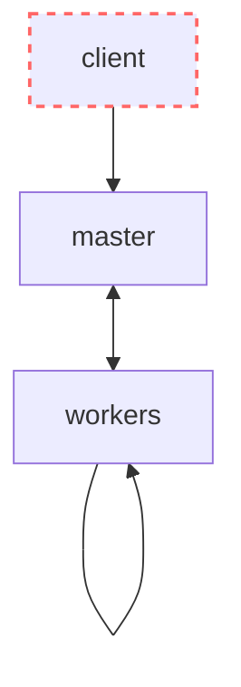

# Building MapReduce from scratch with Python

The goal of this lab is to build a distributed data processing system that allows the user to run MapReduce jobs, which we will call SSMapReduce (Super Simple MapReduce).

This lab is inspired by [MapReduce: Simplified Data Processing on Large Clusters (2008)](https://static.googleusercontent.com/media/research.google.com/en//archive/mapreduce-osdi04.pdf).

# Table of contents

- [Exercises](#exercises)
    - [Seminar 2: MapReduce](#seminar-2-mapreduce)
    - [Lab 4: Worker](#worker)
    - [Lab 5: Master](#master)
    - [Lab 6: Client](#client)

- [Design](#design)
    - [client](#client)
    - [worker](#worker)
    - [master](#master)

# Grade

We have divided exercises into three categories:
- (*) Mandatory: 80% of the project grade, the bare minimum to get it to work
- (**) Recommended: 20% of the project grade
- (***) Optional: addtional +2/10

# Exercises

## Seminar 2: MapReduce

The goal of this seminar is to understand how MapReduce works. [word_count.py](./apps/word_count.py) is an example of a MapReduce script, which you should be able to run with SSMapReduce by the end of the project.

### [S2Q0] [5 marks] Reverse index with MapReduce (*)

Write a MapReduce program to count words in [apps/reverse_index.py](./apps).

### [S2Q1] [5 marks] Counting bigrams with MapReduce (*)

Write a MapReduce program to count worbigramsds in [apps/bigrams.py](./apps).

### [S2Q2] [10 marks] MapReduce architecture (*)

Create 2 [sequence diagrams with Mermaid](https://mermaid.js.org/syntax/sequenceDiagram.html) showing:
- How a MapReduce job is processed (including the map and reduce phases)
- How a master handles a worker failure

## Lab 4: Worker

During this lab, you will implement the `worker` service.

Create a FastAPI service with a Dockerfile in [the worker folder](./worker/).

### [L4Q0] [5 marks] GET /healtcheck (*)

The goal is to implement the [GET /healthcheck](#get-healthcheck) endpoint.

Test it with curl and paste a screenshot.

### [L4Q1] [20 marks] POST /jobs/{job_id}/map (*)

The goal is to implement the [POST /jobs/{job_id}/map](#post-jobsjob_idmap) endpoint. This endpoint will be called by the master to start map tasks.

> [!TIP]
> Use [background tasks](https://fastapi.tiangolo.com/tutorial/background-tasks/) to trigger the map logic in the background after responding to the master.


Test it with curl and paste a screenshot.

### [L4Q2] [10 marks] GET /jobs/{job_id}/map-output?mapPartition={map_partition}&reduucePartition={reduce_partition} (*)

The goal is to implement the [GET /jobs/{job_id}/map-output?mapPartition={map_partition}&reduucePartition={reduce_partition}](#get-jobsjob_idmap-outputmappartitionmap_partitionreduucepartitionreduce_partition) endpoint. This endpoint can be called by a worker doing a reduce to get the map results this worker computed.

Test it with curl and paste a screenshot.


### [L4Q3] [20 marks] POST /jobs/{job_id}/reduce (*)

The goal is to implement the [POST /jobs/{job_id}/reduce](#post-jobsjob_idreduce) endpoint. This endpoint will be called by the master to start reduce tasks.

Test it with curl and paste a screenshot.


### [L4Q4] [5 marks] Docker compose (*)

Add 5 workers to the docker compose file in ports 8001, 8002, ... and 8005.

Add volumes for the [data](./data/), [apps](./apps/) and [results](./results/) folders.

[Configure the hostname](https://stackoverflow.com/questions/29924843/how-do-i-set-hostname-in-docker-compose) of each worker to be `workerX` where X is the index (1, 2, ..., 5). Make sure each worker can communicate with the other ones using the hostname. For example, from `worker1` you should be able to `curl "http://worker2"` and `curl "http://worker4"` (if you get `Not Found` its okey, the problem is if it can't connect to the host). Test it with curl and paste a screenshot.


## Lab 5: Master

During this lab, you will implement the `master` service.

Create a FastAPI service with a Dockerfile in [the master folder](./master/).

### [L5Q0] [15 marks] POST /jobs (*)

The goal is to implement the [POST /jobs](#post-jobs) endpoint. This endpoint will be called by the client to create new MapReduce jobs.

Test it with curl and paste a screenshot.

### [L5Q1] [5 marks] GET /jobs/{job_id} (*)

The goal is to implement the [GET /jobs/{job_id](#get-jobs-job-id) endpoint. This endpoint will be called by the client to get the status of jobs.

Test it with curl and paste a screenshot.

### [L5Q2] [30 marks] POST /jobs/{job_id}/map/{partition}/completed (*)

Implement the [POST /jobs/{job_id}/map/{partition}/completed](#post-jobsjob_idmappartitioncompleted) endpoint to allow workers notifying the master when they have finished a Map task.

Then, extend the workers to call this endpoint when they finish a map task.

Finally, when the last map task of a job is completed, trigger the reduce tasks in the workers.

Test it works with curl and paste a screenshot.

### [L5Q3] [15 marks] POST /jobs/{job_id}/reduce/{partition}/completed (*)

Implement the [POST /jobs/{job_id}/reduce/{partition}/completed](#post-jobsjob_idreducepartitioncompleted) endpoint to allow workers notifying the master when they have finished a Reduce task.

Then, extend the workers to call this endpoint when they finish a reduce task.

Finally, when the last reduce task of a job is completed, change the status of the job to `completed`.

Test you can create jobs, and the map and reduce phases work, ending with the results being stored in the [results folder](./results/) and paste screenshots of the relevant logs and results.

### [L5Q4] [10 marks] Balancing work (**)

Right now, we send tasks to workers immediately. If there are many tasks, the workers could be overwhelmed. Instead, have each worker work on at most 3 tasks at the same time. If all workers are full, wait until they become available to send more tasks to them.

### [L5Q5] [20 marks] Handling failures (***)

Call the `healtcheck` endpoint of `workers` every 30 seconds.

If a `worker` does not respond to the `healthcheck`:
- Don't send any new tasks to that worker until it starts responding to the `/healthcheck`.
- Re-assign any map or reduce tasks it had `in-progress` to other workers.

Test it works with curl and paste a screenshot.

> [!TIP]
> Use [rocketry](https://rocketry.readthedocs.io/en/stable/cookbook/fastapi.html) to trigger the healtchcheck logic every 30 seconds.


### [L5Q6] [15 marks] Persisting jobs (***)

Persist jobs to a file so the `master` can survive restarts.

## Lab 6: Client

### [L6Q0] [15 marks] Implement a Python client (**)

Write client with Python using [click](https://click.palletsprojects.com/en/stable/) that has one command:
- `run`, which takes three arguments: path to the input data, reduce partitions, and name of the MapReduce app

The command should use the master API to:
- create a job
- refresh the job status every 500ms until the job completes
- if the job status changes, print it to stdout using this format: `in-progress - mapping (7/10 done)`, `in-progress - reducing (9/12 done)` or `completed`.

# Design

> [!NOTE]
> This section outlines the requirements and design decisions of the SSMapReduce architecture. You must implement a system that matches this design using Python.

SSMapReduce is composed of 2 services and 1 client:
- The [**client**](#client) allows the user to trigger MapReduce jobs and see their status.
- The [**worker** service](#worker) performs map and reduce tasks.
- The [**master** service](#master) assigns map and reduce tasks to `workers`.

The following diagram represents the dependencies in the system. For example, `client --> master` indicates that `client` depends on `master` (`client` uses the API of `master`).



### client

The client has a single command to create a job and track the job status until completion.

### worker

In SSMapReduce, there's many workers (the worker is horizontally scaled).

In order for the `master` to be able to assign tasks, the `worker` exposes three API endpoints:
- [Healthcheck](#get-healthcheck)
- [Run a map](#post-jobsjob_idmap)
- [Run a reduce](#post-jobsjob_idreduce)

In order for the other `workers` to be able to read the output of a map task this `worker` completed, the `worker` exposes one additional API endpoint:
- [Get the map output](#get-jobsjob_idmap-outputpartition)

#### worker filesystem

The `worker` stores all its data in two folders: `outputs` and `results`.

The `outputs` folder is a folder in the local file system which only this worker can access and it stores the outputs of map tasks. The paths are: `/outputs/{job_id}/{map_partition}/{reduce_partition}`. For example:

```
/outputs
    /617d9970-9b4c-4025-beb8-16ff03afc8d2
        /1
            0
            1
            2
            6
            7
            8
            9
        /2
            1
            2
            3
            7
            8
            9
```

The `results` folder is part of a global file system (volume) shared amongst all workers to store the result of reduce tasks. The paths are: `/outputs/{job_id}/{reduce_partition}`. For example:

```
/results
    /617d9970-9b4c-4025-beb8-16ff03afc8d2
        0
        1
        2
        3
        4
        5
        6
        7
        8
        9
```

#### GET /healthcheck

The healthcheck endpoint always returns a healthy response.

For example:

```
GET /healthcheck
```

Response:
```json
{
    "healthy": true
}
```

#### POST /jobs/{job_id}/map

The map endpoint receives a body with the details of the map task and starts processing it in the background immediately after sending the response.

The body fields are:
- `app_name`: the name of a MapReduce app from the [apps](./apps/) folder, without the `.py` extension.
- `data_path`: the path to a folder which contains one file for every split/partition of the input data
- `map_partition`: the number of the partition that must be read from the `data_path` folder for mapping
- `reduce_partitions`: the number of output partitions after mapping

For example:

```
POST /jobs/617d9970-9b4c-4025-beb8-16ff03afc8d2/map
```

Body:
```json
{
    "app_name": "word_count",
    "data_path": "./data/articles",
    "map_partition": 1,
    "reduce_partitions": 10
}
```

Response:
```json
{
    "status": "in-progress"
}
```

To run the map, you must:
- Dynamically import the `map` function from the client Python app
- Call the `map` function from the client with: key (name of the partition file) and value (content of the partition file)
- Store the list of `(key, value)` returned by the user's map function in the correct file of the `outputs` directory.

##### Dynamically importing the map, reduce and partitioner functions

To dynamically import the map, reduce and partitioner functions written by the user in an app located in the [apps directory](./apps/), use this code:

```python
from importlib import import_module
import sys
sys.path.append("./apps")

def load_app(app_name):
    module = import_module(app_name)
    return (
        getattr(module, "map"),
        getattr(module, "reduce"),
        getattr(module, "partitioner"),
    )

map_function, reduce_function, partition_function = load_app("word_count")
```

##### Deciding the reduce partition

For each key and value returned by the map, it must be appended to a file in `/outputs/{job_id}/{map_partition}/{reduce_partition}`.

To obtain the `reduce_partition`, call the client-defined `partition_function` and use the modulo operator with the `reduce_partitions` integer you received in the body. This will guarantee that:
- All values for the same key are in the same `reduce_partition`
- All keys end up in the same `reduce_partition` regardless of which worker is running it
- All keys are distributed in `reduce_partitions` partitions / files for the reducers to read.

##### The map output files

The result of the map is stored in many files, one per each output partition that has keys in this map task:

```
/outputs
    /617d9970-9b4c-4025-beb8-16ff03afc8d2
        /1
            0
            1
            2
            6
            7
            8
            9
```

Each of these files has the reduce partition number as its name.

The content of this file is one key and one value per line, separated with a space. For example:

```
granted 1
graphite 1
global 1
```

#### GET /jobs/{job_id}/map-output?mapPartition={map_partition}&reduucePartition={reduce_partition}

The `map-output` endpoint allows other workers that need this worker's map output as input for their reduce to read it.

It receives as query parameters:
- `mapPartition`: the number of the map partition to read
- `reducePartition`: inside that mapped partition, which of the output's reduce partition to read

The response consists of a dictionary of each key, and a list of the values produced by the map tasks.

For example:

```
POST /jobs/617d9970-9b4c-4025-beb8-16ff03afc8d2/map-output/3/1
```

Response:
```json
{
    "offers": ["1", "1"],
    "easier": ["1", "1"],
    "effort": ["1", "1", "1"],
    "embrace": ["1"],
    "of": ["1", "1", "1", "1", "1", "1"]
}
```

#### POST /jobs/{job_id}/reduce

The reduce endpoint receives a body with the details of the reduce task and starts processing it in the background immediately after sending the response.

The body fields are:
- `app_name`: the name of a MapReduce app from the [apps](./apps/) folder, without the `.py` extension.
- `reduce_partition`: an integer representing which partition of the map task's output must be processed by this worker
- `map_workers`: a list of URLs of workers which have the results of map tasks for this job

For example:

```
POST /jobs/617d9970-9b4c-4025-beb8-16ff03afc8d2/reduce
```

Body:
```json
{
    "app_name": "word_count",
    "reduce_partition": 1,
    "map_workers": ["http://worker1:80/jobs/617d9970-9b4c-4025-beb8-16ff03afc8d2/map-output/0/1", "http://worker2:80/jobs/617d9970-9b4c-4025-beb8-16ff03afc8d2/map-output/1/1", "http://worker2:80/jobs/617d9970-9b4c-4025-beb8-16ff03afc8d2/map-output/2/1"]
}
```

Response:
```json
{
    "status": "in-progress"
}
```

To run the reduce, you must:
- For every `map_worker` of this job (the ones in the body), fetch their outputs using the [GET /jobs/{job_id}/map-output/{reduce_partition}](#get-jobsjob_idmap-outputreduce_partition) endpoint.
- Aggregate all values for each key across all the map outputs'.
- Dynamically import the `reduce` function from the client Python app [similar to the map](#dynamically-importing-the-map-reduce-and-partitioner-functions)
- Call the `reduce` function from the client with: key (produced by the previous maps) and values list (list of all string values for that key)
- Store the value returned by the user's reduce function in the correct file of the `results` directory.


##### The reduce results files

The result of the map is stored in many files, one per reduce task:

```
/results
    /617d9970-9b4c-4025-beb8-16ff03afc8d2
        0
        1
        2
        6
        7
        8
        9
```

Each of these files has the reduce partition number as its name. Each reduce worker writes a single reduce output file for any given reduce task.

The content of this file is one key and one value per line, separated with a space. The value is the one returned by the user's reduce function. For example:

```
developers 1
not 2
deep 1
derived 1
network 1
doubt 1
neural 1
new 2
discomfort 1
```


### master

In SSMapReduce, there's one master (the master is vertically scaled).

The `master` exposes two endpoints for the client to create jobs and check its status:
- [Create a job](#post-jobs)
- [Read a job by id](#get-jobsjob_id)

In order for the `workers` to notify the master when they finish a task, the master exposes two additional endpoints:
- [Map completed](#post-jobsjob_idmappartitioncompleted)
- [Reduce completed](#post-jobsjob_idreducepartitioncompleted)

The master stores all of its state in memory. Namely, it has a `jobs` dictionary in a variable where it stores and update the state of all jobs.

The master should read a `config.json` file with the URLs of all the workers in the system:

```json
{
    "workers": ["http://worker1:80", "http://worker2:80", "http://worker3:80", "http://worker4:80", "http://worker5:80"]
}
```

#### POST /jobs

This endpoint allows the caller to trigger a new MapReduce job. It takes the following body parameters:
- `app_name`: the name of a MapReduce app from the [apps](./apps/) folder, without the `.py` extension.
- `data_path`:  the path to a folder which contains one file for every split/partition of the input data
- `map_partitions`: an integer representing how many files/partitions are in the folder in the `data_path`
- `reduce_partitions`: an integer representing how many files/partitions the output should be divided in after reducing

When a new job is received:
- The master generates a new id using [uuid4](https://www.uuidgenerator.net/dev-corner/python).
- Selects a worker using modulo and [sends the worker a map task using the API](#post-jobsjob_idmap)
- Stores the job, as well as all the workers that have been assigned to its in-memory dictionary

For example:

```
POST /jobs
```

Body:
```json
{
    "app_name": "word_count",
    "data_path": "./data/articles",
    "map_partitions": 3,
    "reduce_partitions": 10
}
```

Response:
```json
{
    "job_id":"617d9970-9b4c-4025-beb8-16ff03afc8d2",
    "app_name":"word_count",
    "data_path":"./data/articles",
    "map_partitions":3,
    "reduce_partitions":10,
    "mappers":[
        {"worker":"worker3:80","status":"in-progress","partition":0},
        {"worker":"worker1:80","status":"in-progress","partition":1},
        {"worker":"worker2:80","status":"in-progress","partition":2}
    ],
    "reducers":[
        {"worker":null,"status":"idle","partition":0},
        {"worker":null,"status":"idle","partition":1},
        {"worker":null,"status":"idle","partition":2},
        {"worker":null,"status":"idle","partition":3},
        {"worker":null,"status":"idle","partition":4},
        {"worker":null,"status":"idle","partition":5},
        {"worker":null,"status":"idle","partition":6},
        {"worker":null,"status":"idle","partition":7},
        {"worker":null,"status":"idle","partition":8},
        {"worker":null,"status":"idle","partition":9}
    ],
    "status":"in-progress"
}
```

#### GET /jobs/{job_id}

This endpoint reads the job status from the in-memory dictionary and returns it.

```
GET /jobs/617d9970-9b4c-4025-beb8-16ff03afc8d2
```

Response:
```json
{
    "job_id":"617d9970-9b4c-4025-beb8-16ff03afc8d2",
    "app_name":"word_count",
    "data_path":"./data/articles",
    "map_partitions":3,
    "reduce_partitions":10,
    "mappers":[
        {"worker":"worker3:80","status":"in-progress","partition":0},
        {"worker":"worker1:80","status":"in-progress","partition":1},
        {"worker":"worker2:80","status":"in-progress","partition":2}
    ],
    "reducers":[
        {"worker":null,"status":"idle","partition":0},
        {"worker":null,"status":"idle","partition":1},
        {"worker":null,"status":"idle","partition":2},
        {"worker":null,"status":"idle","partition":3},
        {"worker":null,"status":"idle","partition":4},
        {"worker":null,"status":"idle","partition":5},
        {"worker":null,"status":"idle","partition":6},
        {"worker":null,"status":"idle","partition":7},
        {"worker":null,"status":"idle","partition":8},
        {"worker":null,"status":"idle","partition":9}
    ],
    "status":"in-progress"
}
```

It must return a 404 if the job is not found.

#### POST /jobs/{job_id}/map/{partition}/completed

This endpoint allows a `worker` to let the `master` know that it has finished the map task for partition `{partition}`.

When the `master` receives a map task completion notification, it must update the task status in the in-memory dictionary. Then, if there are no mapping tasks pending completion, it must start sending the reduce tasks to the workers.

For example:

```
POST /jobs/617d9970-9b4c-4025-beb8-16ff03afc8d2/map/2/completed
```

Response:
```json
{
    "message": "Status updated"
}
```


#### POST /jobs/{job_id}/reduce/{partition}/completed

This endpoint allows a `worker` to let the `master` know that it has finished the reduce task for partition `{partition}`.

When the `master` receives a reduce task completion notification, it must update the task status in the in-memory dictionary. Then, if there are no reduce tasks pending completion, it must mark the overall job status as `completed`.


For example:

```
POST /jobs/617d9970-9b4c-4025-beb8-16ff03afc8d2/reduce/2/completed
```

Response:
```json
{
    "message": "Status updated"
}
```

