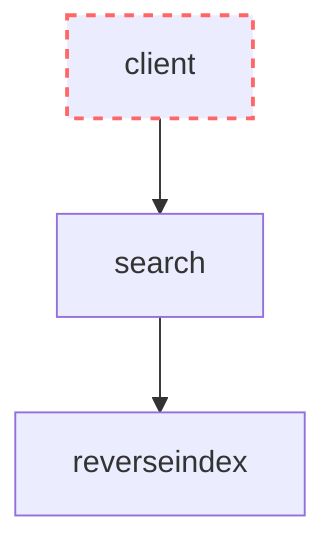

# Building Google with Spark

The goal of this lab is to use Spark RDDs to build a reverse index of Wikipedia articles and then build a super-simple search engine (SSSE) like Google on top of it.

# Table of contents

- [Exercises](#exercises)
    - [Seminar 2: Build a reverse-index with Spark RDDs](#seminar-2-build-a-reverse-index-with-spark-rdds)
    - [Lab 4: The reverse-index service](#lab-4-the-reverse-index-service)
    - [Lab 5: The search service](#lab-5-the-search-service)
- [Design](#design)
    - [Reverse index](#reverse-index)
    - [Search](#search)

# Grade

We have divided exercises into three categories:
- (*) Mandatory: 80% of the project grade, the bare minimum to get it to work
- (**) Recommended: 20% of the project grade
- (***) Optional: addtional +2/10

# Exercises

## Seminar 2: Build a reverse-index with Spark RDDs

The goal of this seminar is learning how to use Spark RDDs and then use Spark to download many Wikipedia articles and build a reverse-index.

> [!TIP]
> Read the [RDD Programming Guide](https://spark.apache.org/docs/latest/rdd-programming-guide.html) to learn how to code Spark jobs.

During this seminar, you will need to use Python lambda functions. A lambda function is just a shorter way to write a function:

```python
def multiply(a, b):
  return a * b

multiply = lambda a, b: a * b
```

Start a Spark cluster locally using Docker compose: `docker-compose -f compose.spark.yaml up`. 

This cluster has 2 workers and a master. You can use the following command to open a terminal in the master server: `docker-compose -f compose.spark.yaml exec spark-master`

Check the local IP for the Spark Master service in the `spark-master-1` container logs. You should see a log similar to `Starting Spark master at spark://172.20.0.2:7077`.

To run a job with Spark, run the `spark-submit` command in the master: `docker-compose -f compose.spark.yaml exec spark-master spark-submit --master spark://{IP_FROM_PREVIOUS_STEP}:7077 /opt/bitnami/spark/app/spark_sum.py /opt/bitnami/spark/app/data/numbers1.txt`

### [S2Q0] [5 marks] Sum the numbers (*)

The file [numbers2.txt](./data/numbers2.txt) has many lines, each with many numbers.

- Create a file `spark_sum2.py`
- Implement and run a Spark job that computes the sum of all the numbers.
- Write the command you used to run it in the README and show a screenshot of the result.

### [S2Q1] [5 marks] Sum the even numbers (*)

The file [numbers2.txt](./data/numbers2.txt) has many lines, each with many numbers.

- Create a file `spark_sum3.py`
- Implement and run a Spark job that computes the sum of all the even numbers.
- Write the command you used to run it in the README and show a screenshot of the result.

### [S2Q2] [5 marks] Find how many people live in each city (*)

The file [people.txt](./data/people.txt) has many lines, each with `{NAME} {LANGUAGE} {CITY}`.

- Create a file `spark_count_people.py`
- Implement and run a Spark job that counts how many people live in each city.
- Write the command you used to run it in the README and show a screenshot of the result.

### [S2Q3] [5 marks] Count the bigrams (*)

The file [cat.txt](./data/cat.txt) has many lines, each with a sentence.

- Create a file `spark_count_bigrams.py`
- Implement and run a Spark job that counts how many times each bigram appears.
- Write the command you used to run it in the README and show a screenshot of the result.


## Lab 4: The reverse-index service

The goal of this lab is to build a distributed service which allows us to find which Wikipedia articles contain any specific word with low latency.

### [L4Q0] [5 marks] Downloading Wikipedia articles (*)

Find the latest available Wikipedia datasets from [dumps.wikimedia](https://dumps.wikimedia.org/other/enterprise_html/runs/). For example, `https://dumps.wikimedia.org/other/enterprise_html/runs/20250201/enwiki-NS0-20250201-ENTERPRISE-HTML.json.tar.gz`. Finally, use the following command to download the first 50k articles:

```zsh
curl -L https://dumps.wikimedia.org/other/enterprise_html/runs/20250201/enwiki-NS0-20250201-ENTERPRISE-HTML.json.tar.gz | tar xz --to-stdout | head -n 50000 > data/wikipedia50k.json
```

Take a look at the first article:

```zsh
cat data/wikipedia50k.json | head -n 1 | jq > first.json
```

- What field contains the id of the article?
- What field contains the abstract?
- What field contains the HTML version of the article?

### [L4Q1] [20 marks] Build a reverse-index (*)

A reverse-index is a data structure that, for each word, lists all webpages where it appears. This allows us to efficiently filter webpages depending on the words the user is searching for.

For example, the following reverse index says the webpage with id `76669474` contains the words `seven`, `seasons` and `sold`.

```
seven 18847712 76669474 76713187 75388615
seasons 58765506 76669474 7755966 66730851
due 76731844 41098246 25214406 41098253 1658830 31581711 8905616
sold 76669474 31728882 53538197 63141238 12243595
```

- Create a file `spark_reverse_index.py`
- Implement and run a Spark job that:
  - Reads the `wikipedia50k.json` dataset
  - Filters out articles without identifier or abstract
  - Computes a reverse index for each word in the abstract
  - Partitions the output based on the first character of the word, creating 10 partitions
  - Writes the reverse index to a file (one per partition), where each line has the word and all the document ids where it appears, separated by spaces


### [L4Q2] [10 marks] POST /reverse-index (*)

Implement a FastAPI service in [reverseindex](./reverseindex/). 

When the `reverseindex` service starts:
- Reads the `INDEX_PARTITION_PATH` [environment variable](https://stackoverflow.com/questions/4906977/how-can-i-access-environment-variables-in-python).
- Loads the partition of the reverse-index into memory as a dictionary

Then, implement the [POST /reverse-index](#post-reverse-index) endpoint, which must return a list of article ids where any given word is present.

### [L4Q2] [5 marks] Add reverseindex to docker compose (*)

Add 10 shards of the reverse-index service in the [compose.yaml](./compose.yaml), one for each partition of the reverse-index.

## Lab 5: The search service

The goal of this lab is to build the repository service which allows us to fetch all the information of any article.

### [L5Q0] [10 marks] Preparing the files (*)

Write a script that divides `wikipedia50k.json` into 50k JSON files, one for each file (with the name of the article id).

### [L5Q1] [10 marks] GET /articles/{id} (*)

Create a FastAPI API in [search](./search/) and add it to the docker compose.

Then, implement the [GET /articles/{id}](#get-articles-id) endpoint:
- When a request is received, load the article from the file system.
- The endpoint must return all the article information as JSON
- Make sure you handle edge cases (e.g. no article found for an id)

Test the service works with curl and paste a screenshot.

### [L5Q2] [20 marks] POST /search (*)

Implement the [POST /search](#post-search) endpoint:
- When a request is received, use the `reverseindex` API to load the list of document ids which contain each of the words.
- The endpoint must return the first `count` (from the query, at most 10) articles that contain all the words.

Test the service works with curl and paste a screenshot.

### [L5Q2] [10 marks] Excluding keywords (**)

Extend the [POST /search](#post-search) endpoint, such that the user can write keywords prefixed with `-` to filter out articles that contain that word.

### [L5Q3] [10 marks] Create a client (**)

Create a `search.py <count> <word> <word> ...` file in the [client folder](./client/).

The script must receive:
- the count, the number of articles to fetch
- any number of keywords, all the words which the user is searching for

Then, it must print the name, abstract, date created and date modified of each of the results.

### [L5Q4] [20 marks] Create a web UI (***)

Create a simple website with HTML and JS that allows searching and viewing wikipedia articles.

- You can create an HTML page with [an input and a button](https://developer.mozilla.org/en-US/docs/Web/HTML/Element/input/search) to create a search page.
- You can use the [onclick event](https://www.w3schools.com/JSREF/event_onclick.asp) to call a JS function when the user clicks search.
- Then, you can use the [fetch function](https://www.freecodecamp.org/news/javascript-post-request-how-to-send-an-http-post-request-in-js/) to make a POST request in JS.
- Finally, you can show the results by appending HTML.

You can also use react and vite instead of raw HTML and JS if you prefer so.

## Seminar 3: Running Spark in AWS

AWS allows us to rent virtual servers and deploy a Spark cluster to do data anlysis at scale. In this seminar, you will learn how to:
- Use S3 to store and read files
- Use AWS EMR to host a Spark cluster in AWS EC2 servers
- Run some of your Spark applications in the cluster.

### [S4Q0] [10 marks] Run L4Q1 in AWS using EMR

- Accept the invitation to AWS academy.
- Open the [AWS Academy](https://awsacademy.instructure.com/courses) course
- In `Modules`, select `Launch AWS Academy Learner Lab`
- Click `Start Lab`
- Wait until the `AWS` indicator has a green circle
- Click the `AWS` text with the green circle to open the AWS console

> [!TIP]
> When you launch a cluster, you start spending AWS credit! Remember to terminate your cluster at the end of your experiments!

- [Create a bucket in S3](https://us-east-1.console.aws.amazon.com/s3/home?region=us-east-1#):
    - Bucket type: `General purpose`
    - Name: `lsds-2025-{group_number}-t{theory_number}-p{lab_number}-s{seminar_number}-s3bucket`

- Paste a screenshot

- In the bucket, create 4 folders: `input`, `app`, `logs` and `output`

- Paste a screenshot

- Upload the `wikipedia50k.json` file inside the `input` folder

- Paste a screenshot

- Upload `spark_reverse_index.py` in the `app` folder

- Paste a screenshot

- Open the [EMR console](https://us-east-1.console.aws.amazon.com/emr/home?region=us-east-1#/clusters)

- Create a cluster
    - Application bundle: `Spark Interactive`
    - Name: `lsds-2025-{group_number}-t{theory_number}-p{lab_number}-s{seminar_number}-sparkcluster`
    - Choose this instance type: `m4.large`
    - Instance(s) size: `3`
    - Cluster logs: select the `logs` folder in the S3 bucket you created
    - Service role: `EMR_DefaultRole`
    - Instance profile: `EMR_EC2_DefaultRole`
    
- Paste a screenshot

- In `Steps`, select `Add step`.
    - Type: `Spark application`
    - Name: `reverseindex`
    - Deploy mode: `Cluster mode`
    - Application location: select the `spark_reverse_index.py` in the S3 bucket
    - Spark-submit options: specify the `spark_reverse_index.py` module. For example: `--py-files s3://lsds-2025-miquel-test/app/spark_reverse_index.py`
    - Arguments: specify the input and output. For example: `s3://lsds-2025-miquel-test/input/wikipedia50k.json s3://lsds-2025-miquel-test/input/reverseindex.json`.

- Paste a screenshot

- When you submit a step, wait until the `Status` is `Completed`. 

- Paste a screenshot

> [!TIP]
> You can find the logs in your S3 bucket: `logs/{cluster id}/containers/application_*_{run number}/container_*_000001/stdout.gz` - they might take some minutes to appear

- Paste a screenshot of the log where we can see: how much time it took, what are the ids of the ten most retweeted users.

## Design

SSSE is composed of 2 services:
- The [**reverse-index** service](#reverse-index) allows fast lookup of all article ids where any given word appears
- The [**search** service](#search) returns all the articles which contain all the words in the user query

The following diagram represents the dependencies in the system. For example, `search --> repository` indicates that `search` depends on `repository` (`search` uses the API of `repository`).



### Reverse-index

The reverse-index is a sharded service. Each instance of the service has a part of the reverse-index in memory. The `INDEX_PARTITION_PATH` environment variable has the path to the reverse-index file that needs to be loaded.

It only exposes one endpoint:

- [POST /reverse-index](#post-reverse-index)

#### POST /reverse-index

When a client sends a POST to the `/reverse-index` endpoint, it can specify one word in the body and it returns a list of article ids which contain the word.

```
POST /reverse-index
```

Body:
```json
{
    "word": "hello"
}
```

Response:
```json
{
    "articles": [
        123123, 312421834, 3124, 21344536, 38742612, 988, 3214786234, 23423415234, 43524
    ]
}
```

If the word is not found in the index, it returns an empty list of articles.

### Search

The search service is in charge of receiving user search queries and returning the articles that contain the given keywords.

It exposes two endpoints:
- [GET /articles/{id}](#get-articlesid)
- [POST /search](#post-search)

#### GET /articles/{id}

The GET `/articles/{id}` endpoint allows getting all the details of a Wikipedia article given it's id.

For example:

```
GET /articles/40780830
```

Response:
```json
{
  "name": "Corrective Revolution (Egypt)",
  "identifier": 40780830,
  "abstract": "The Corrective Revolution was a reform program launched on 15 May 1971 by President Anwar Sadat. It involved purging Nasserist members of the government and security forces, often considered pro-Soviet and left-wing, and drumming up popular support by presenting the takeover as a continuation of the Egyptian Revolution of 1952, while at the same time radically changing track on issues of foreign policy, economy, and ideology. This includes a large shift in Egyptian diplomacy, building ties to the United States and Israel, while breaking from the USSR and, after signing the Egyptian–Israeli Peace Treaty, Egypt's subsequent suspension from the Arab League. Sadat's Corrective Revolution also included the imprisonment of other political forces in Egypt, including leftists and officials still loyal to Nasserism. Sadat used the Corrective Revolution as a way to 'exorcise Nasser's ghost' from Egyptian politics, and to establish his domestic legitimacy.",
  "date_created": "2013-10-13T10:58:40Z",
  "date_modified": "2024-04-23T02:42:44Z",
  "date_previously_modified": "2023-10-30T00:41:57Z",
  "url": "https://en.wikipedia.org/wiki/Corrective_Revolution_(Egypt)",
  "categories": [
    {
      "name": "Category:Articles with short description",
      "url": "https://en.wikipedia.org/wiki/Category:Articles_with_short_description"
    },
    {
      "name": "Category:CS1 errors: missing periodical",
      "url": "https://en.wikipedia.org/wiki/Category:CS1_errors:_missing_periodical"
    }
  ],
  "article_body": {
    "html": "..."
  },
  "license": [
    {
      "name": "Creative Commons Attribution Share Alike 3.0 Unported",
      "identifier": "CC-BY-SA-3.0",
      "url": "https://creativecommons.org/licenses/by-sa/3.0/"
    }
  ],
  "event": {
    "identifier": "bbb3a59b-65f6-4119-85c5-f172ca76daf0",
    "type": "update",
    "date_created": "2024-04-23T02:42:44.9289Z",
    "date_published": "2024-04-23T02:42:46.013674Z"
  }
}
```

#### POST /search

The POST `/search` endpoint allows searching for articles that contain a list of keywords.

For example:

```
POST /search
```

Body:
```json
{
  "query": "barcelona 1992 olympics"
}
```

Response:
```json
{
  "results": [
    {
      "id": 2131354,
      "title": "Barcelona",
      "abstract": "Barcelona is a city in the..."
    },
    {
      "id": 213154,
      "title": "1992 Olympics",
      "abstract": "The 1992 summer olympics were hosted in Barcelona..."
    }
  ]
}
```
